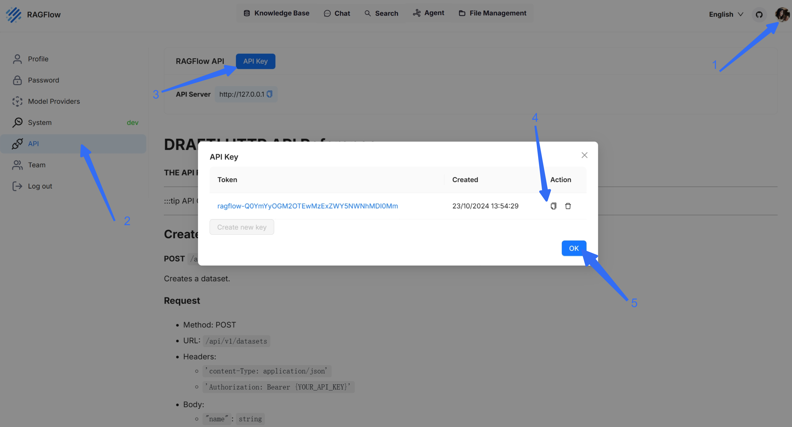
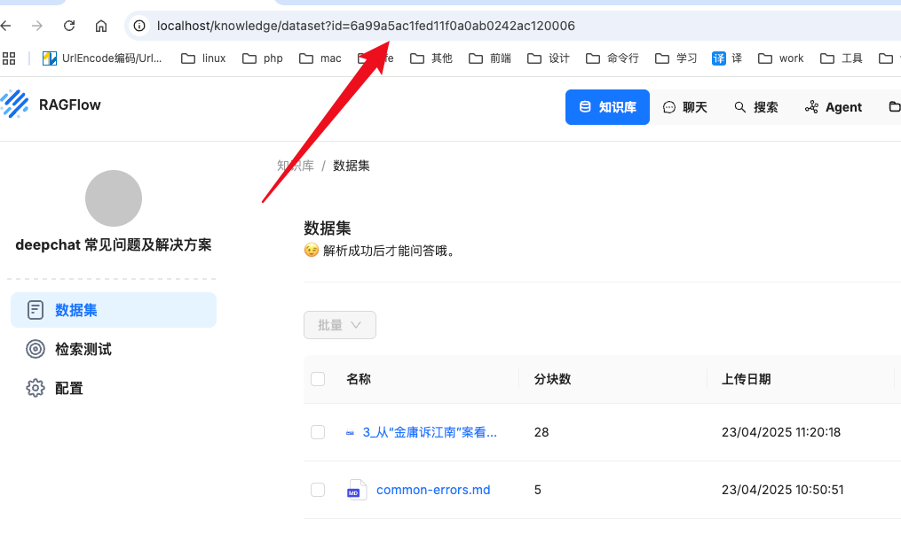
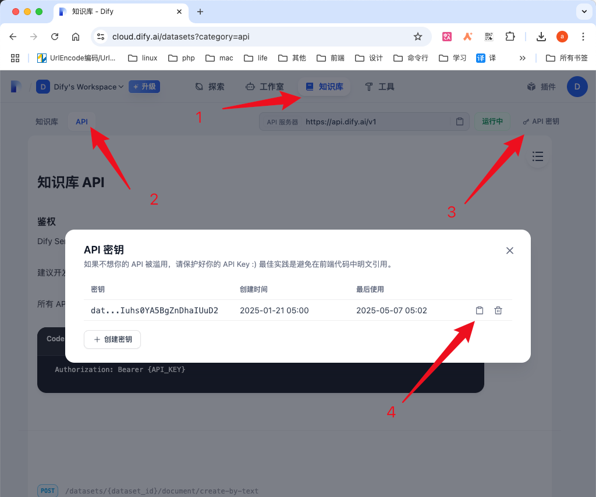
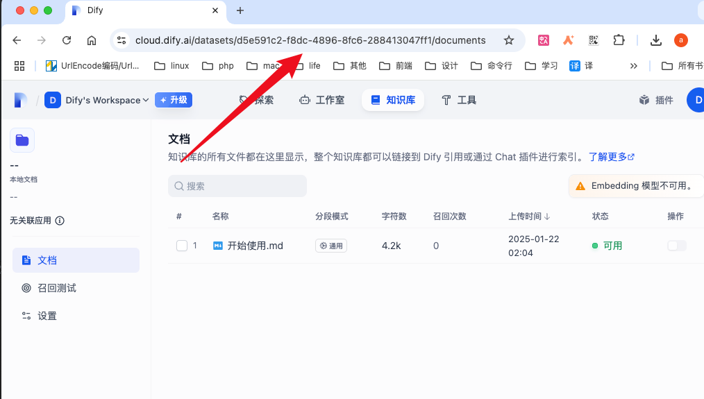
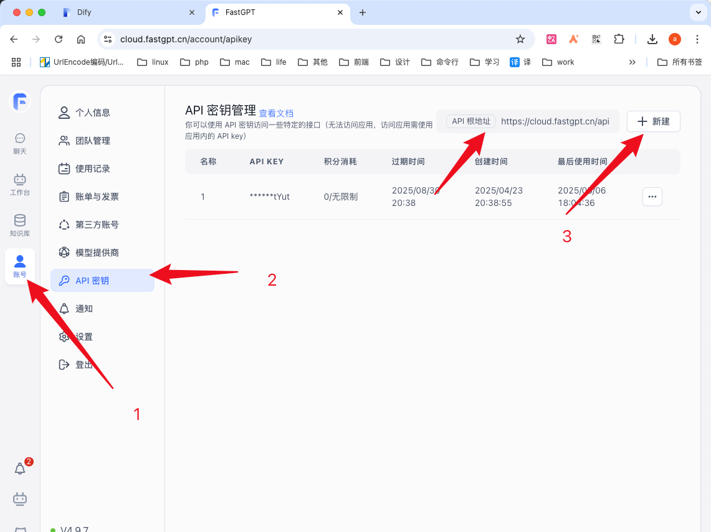
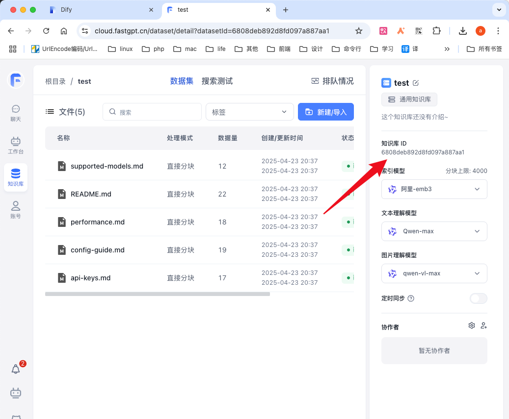
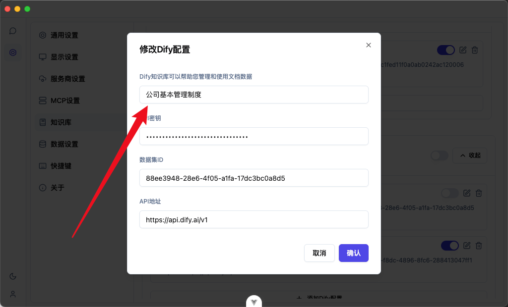

# 知识库

DeepChat 提供强大的知识库支持，让您能够将自己的专业知识与 AI 助手无缝集成，显著提高 AI 回答的准确性、相关性和实用性。通过知识库功能，您可以让 AI 基于您的专有资料回答问题，实现真正的个性化智能助手。

## 功能概述

## 支持的知识库类型

DeepChat 目前支持以下三种主流知识库系统：

- **RAGFlow知识库**：强大的检索增强生成流程系统，支持复杂知识结构和多数据集
- **Dify知识库**：用户友好的 AI 应用开发平台，提供简单易用的知识库管理
- **FastGPT知识库**：轻量级知识库系统，适合快速部署和简单应用场景

## 添加知识库

### 基本步骤

1. 进入 DeepChat 设置页面
2. 选择「知识库」选项
3. 点击「添加知识库」按钮
4. 选择知识库类型并填写相关配置信息
5. 保存

### RAGFlow知识库配置

1. **服务器地址**：输入您的 RAGFlow 服务器地址
2. **API密钥**：从 RAGFlow 管理界面获取 API 密钥
3. **数据集ID**：从浏览器地址栏获取数据集 ID（如图所示）

**注意事项**：
- RAGFlow 目前官方体验环境的知识库无法直接使用，需要自行部署后使用
- RAGFlow 支持添加多个数据集 ID，可以同时查询多个知识库
- 建议使用最新版本的 RAGFlow 以获得最佳体验

### Dify知识库配置

1. **服务器地址**：输入 Dify 服务器地址（官方或自部署）
2. **API密钥**：从 Dify 平台获取 API 密钥
3. **数据集ID**：从浏览器地址栏中 datasets 后面的内容获取

**注意事项**：
- Dify 可以直接使用官方的体验地址，也可以在本地部署
- Dify 的数据集 ID 只能填入一个，不支持多数据集同时查询
- 确保您有足够的 API 调用权限

### FastGPT知识库配置

1. **服务器地址**：输入 FastGPT 服务器地址
2. **API密钥**：从 FastGPT 平台获取 API 密钥
3. **数据集ID**：按照界面指引获取数据集 ID

**注意事项**：
- FastGPT 可以直接使用官方的体验地址，也可以在本地部署
- FastGPT 的数据集 ID 只能填入一个
- 适合快速部署和简单应用场景

## 使用技巧与最佳实践

### 知识库标题设置

在 DeepChat 的知识库配置页填入知识库标题时，请确保标题准确反映知识库的核心内容。标题设置非常重要，它决定了大模型在回答问题时是否会调用该知识库。

### 提高知识库效果的建议

- **精确命名**：为知识库取一个能准确描述其内容的名称
- **内容组织**：将相关内容组织在同一知识库中，提高检索效率
- **定期更新**：保持知识库内容的更新，确保信息准确性
- **测试验证**：添加知识库后进行测试，确认 AI 能正确调用和理解知识库内容

## 常见问题解答

### 为什么 AI 没有使用我的知识库回答问题？

可能的原因：
- 知识库标题与问题主题不匹配
- 知识库配置有误（API密钥、服务器地址等）
- 知识库内容与问题不相关

### 如何检查知识库是否正常工作？

您可以：
1. 在对话中明确提及知识库主题
2. 查看对话日志中是否有知识库调用记录
3. 测试简单且明确的问题，确认知识库响应

## 下一步

成功配置知识库后，我们推荐您探索 DeepChat 的[模型集成](../model-integration/)功能，了解如何配置和使用不同的语言模型，进一步提升 AI 助手的能力。
