# MCP

DeepChat 提供大量内置MCP，实现大语言模型与外部数据源和工具的集成，用来在大模型和数据源之间建立安全双向的连接。

## 内置服务
DeepChat 内置了多个服务，可以根据您的需求选择适合的服务。
- [文件系统](#文件系统)
- [Artifacts](#Artifacts)
- [博查搜索](#博查搜索)
- [Brave搜索](#Brave搜索)
- [图片服务](#图片服务)
- [增强工具包](#增强工具包)
- [dify知识库检索](#dify知识库检索)
- [ragflow知识库检索](#ragflow知识库检索)
- [FastGPT知识库检索](#FastGPT知识库检索)
- [DeepResearch](#DeepResearch)
- [自动模板提示词](#自动模板提示词)
- [对话历史搜索](#对话历史搜索)
- [自定义提示词](#自定义提示词)

### 文件系统
让 DeepChat 能够操作本地文件
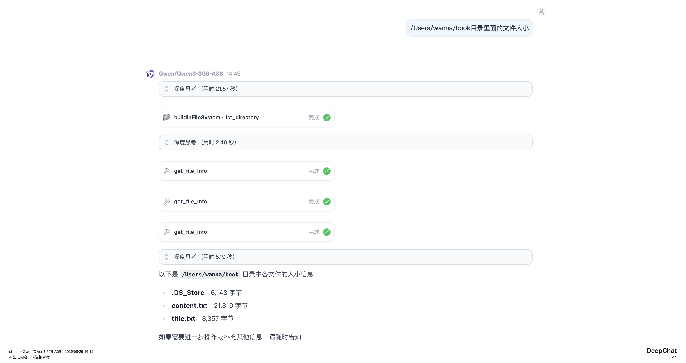

##### 功能介绍
- 读取文件
- 批量读取文件
- 写入文件：创建新文件或用新内容完全覆盖现有文件
- 修改文件：对文本文件进行基于行的编辑
- 新增目录
- 列出目录：列表模式
- 列出目录：tree模式
- 移动文件
- 批量移动文件
- 搜索文件
- 获取文件信息
- 列出全部有权限操作的目录

#### 注意事项
- 使用时注意配置允许访问的文件夹路径
- 如果需要写入文件，需要在‘自动授权’中开启写入权限

### Artifacts
让你的 DeepChat 输出的多样化的 Artifacts 内容
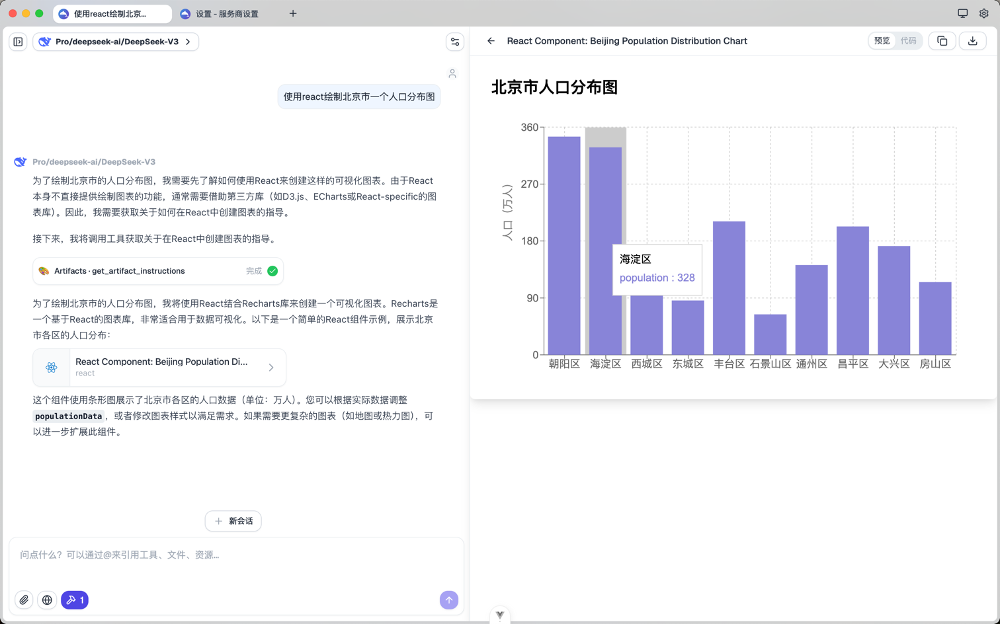

#### 功能介绍
- 代码
- 文档
- HTML
- SVG
- Mermaid图
- React组件

### 博查搜索
博查搜索 API https://open.bochaai.com/

#### 功能介绍
- 网页搜索：从数十亿个Web文档中获取增强的搜索详细信息，包括页面标题、网址、摘要、网站名称、网站图标、发布日期、图像链接等。
- ai 搜索：识别搜索词的语义，并额外返回包含垂直域内容的结构化数据。

### Brave搜索
Brave搜索 API https://brave.com/search/api/

#### 功能介绍
- 网页搜索：非常适合常规查询、新闻、文章和在线内容。用于广泛的信息收集、最近的事件，或者当您需要不同的网络资源时。支持分页、内容过滤和新鲜度控制。每个请求最多20个结果，带分页偏移。
- 位置搜索：如企业、餐馆等，会返回企业名称、详细地址、评论数、评级、电话号码、营业时间等。

### 图片服务
开启后 DeepChat 中任意模型都能看懂图片，能生成图片
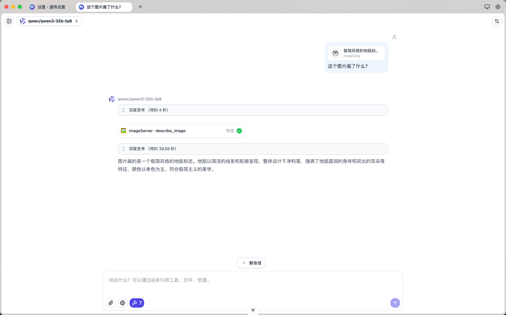

#### 功能介绍
- 图片转base64
- 上传照片
- 批量图片转base64
- 对图片内容进行描述
- 使用多模态模型对图片进行提问
- 对图片进行ocr识别，并返回所以文字内容

#### 注意事项
- 需要在‘图片服务’ mcp配置里面选择一个‘视觉模型’ 
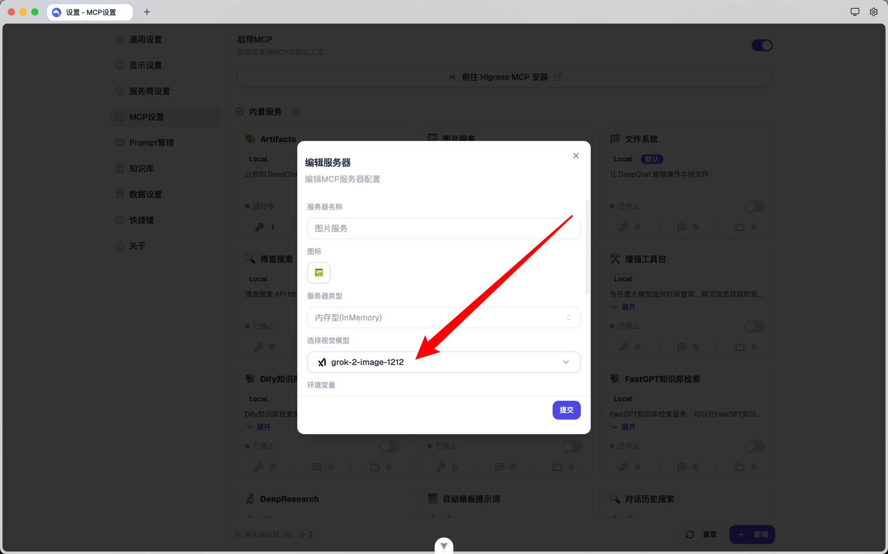

### 增强工具包
为任意大模型提供时间查询、网页信息获取和安全的代码执行等增强能力，让模型拥有更强大和准确的信息获取能力
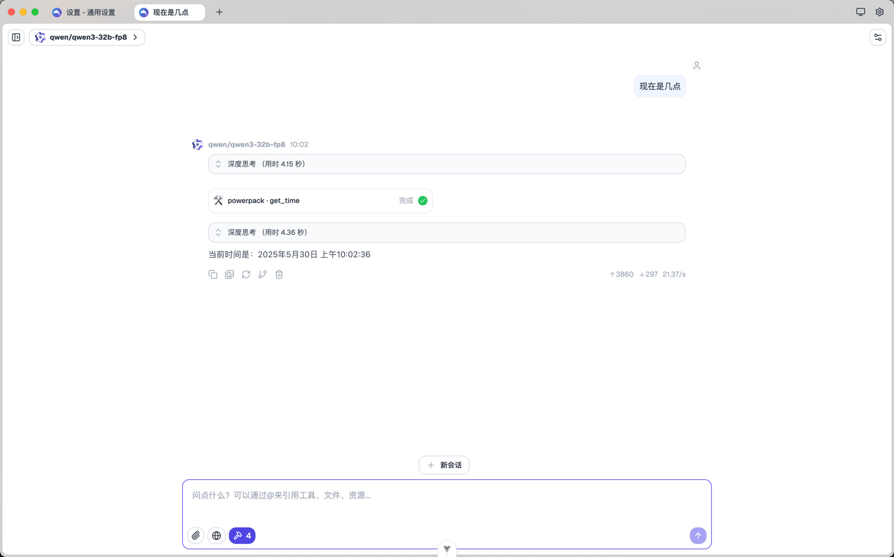

#### 功能介绍
- 时间查询
- 网页信息获取
- 在沙箱环境安全运行node代码
- 在沙箱环境安全运行python代码

### dify知识库检索
让deepchat可以链接到dify知识库，从而实现知识库检索

### ragflow知识库检索
让deepchat可以链接到ragflow知识库，从而实现知识库检索

### fastgpt知识库检索
让deepchat可以链接到fastgpt知识库，从而实现知识库检索
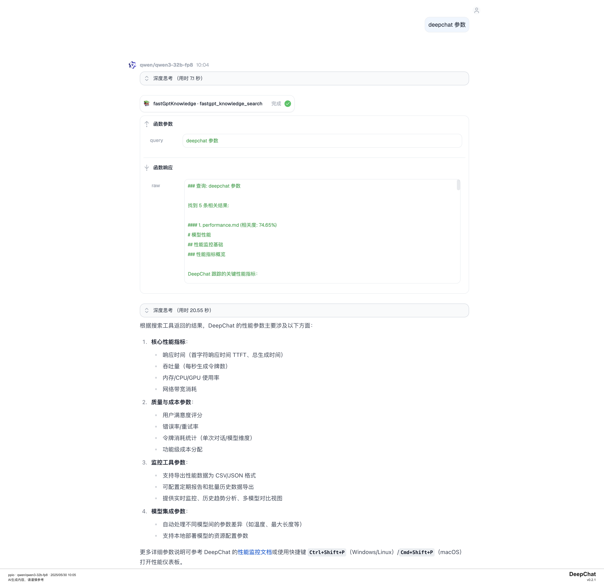

### DeepResearch
基于博查搜索的DeepChat内置深度研究服务，（注意需要长上下文模型才能使用，上下文不足的模型可能会失败）

### 自动模板提示词
根据用户输入自动选择最合适的自定义提示词，并智能填充提示词模板
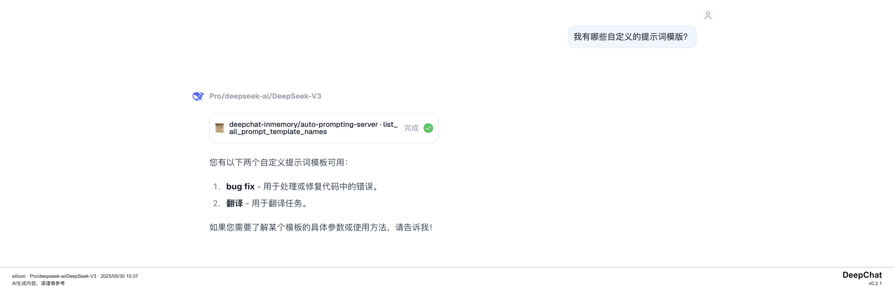

#### 功能介绍
- 列出全部提示词模版
- 根据提示词模板名称获取其所需的参数列表和描述。
- 根据提示词模板名称和参数，填充模板内容并生成最终的Prompt。

### 对话历史搜索
DeepChat内置对话历史搜索服务，可搜索历史对话记录和消息内容

#### 功能介绍
- 搜索历史对话记录
- 搜索历史消息内容
- 获取对话状态

### 自定义提示词
DeepChat内置自定义提示词服务，配合[自动模板提示词](#自动模板提示词)使用
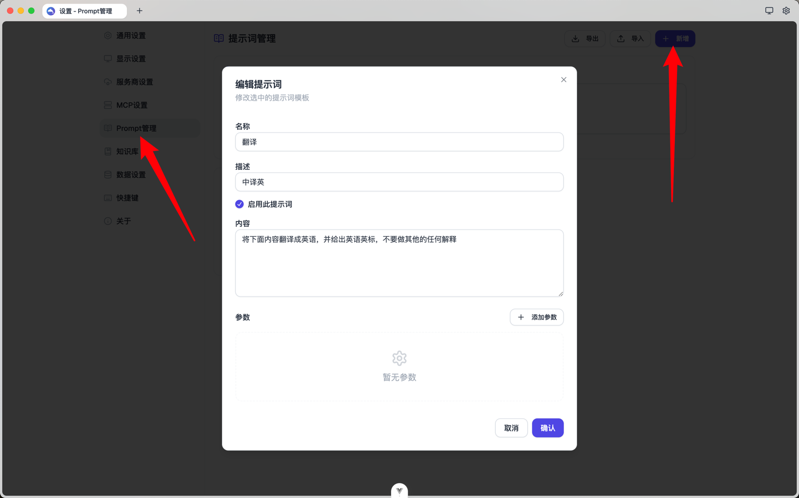
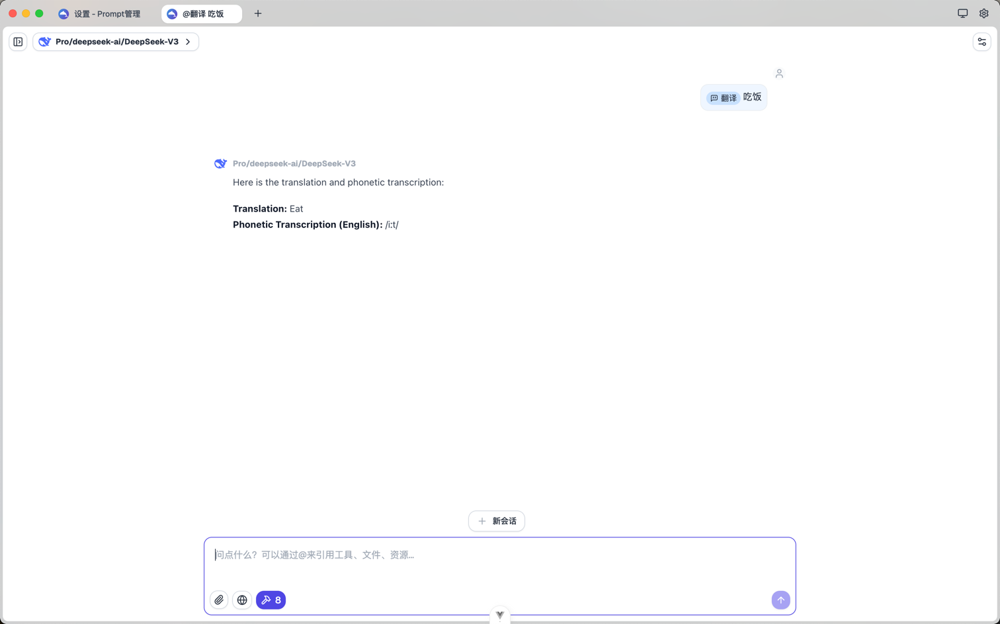

## 通过 higress 安装 mcp
1. 通过链接跳转到 [higress 官网](https://mcp.higress.ai/?from=deepchat) 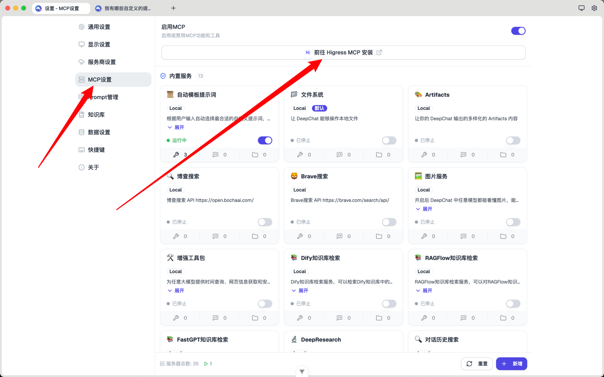
2. 登录 higress 账号
3. 找到自己想要安装的项目，并点击确定
4. 找到 deepchat mcp 安装键！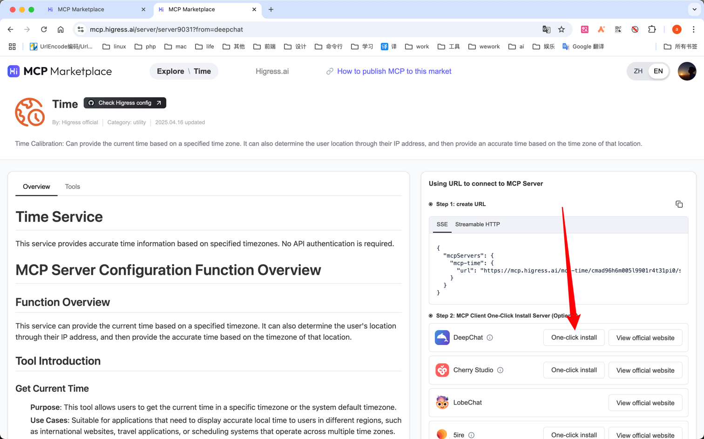
5. 在 deepchat 的 mcp 配置页面点击新增，此时会自动解析数据并填充，检查无误后点击保存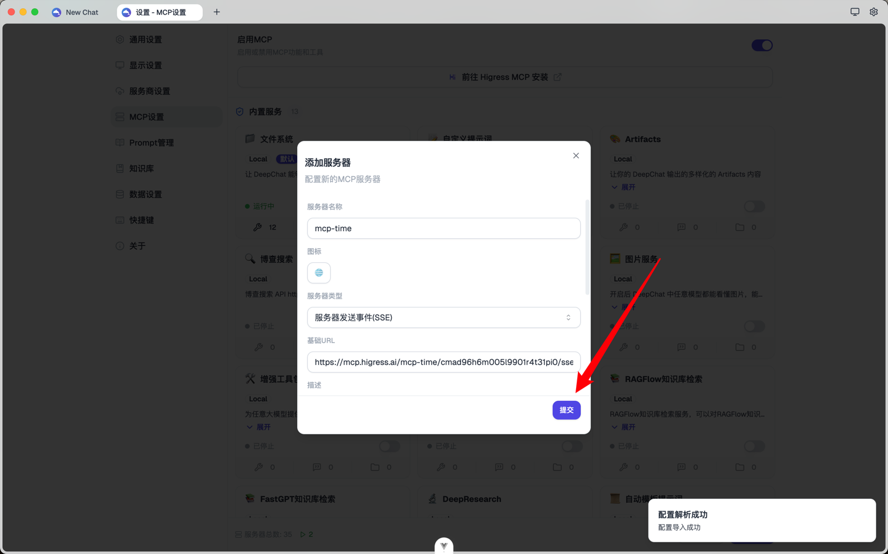

下一步，您可以了解 DeepChat 的[知识库](./knowledge.md)功能，探索如何提高AI的回答质量。 
