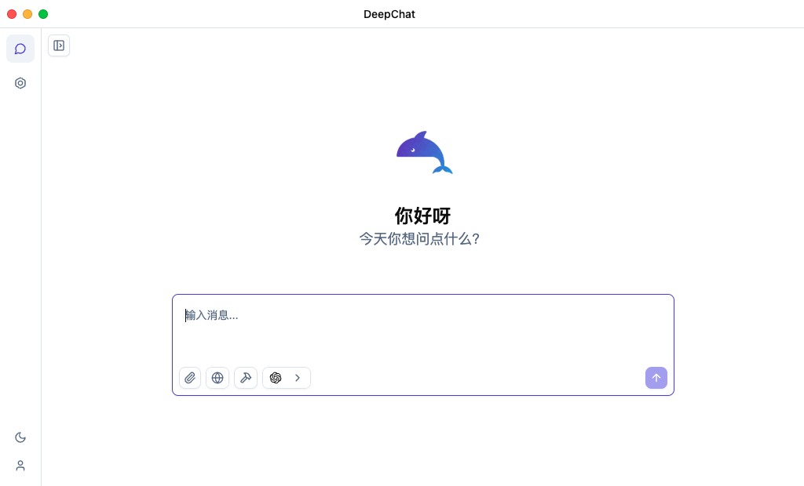
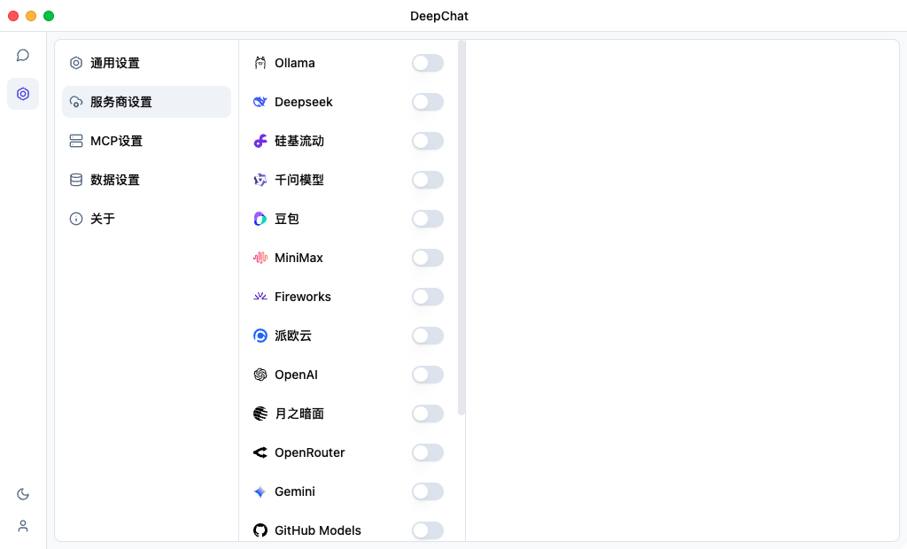
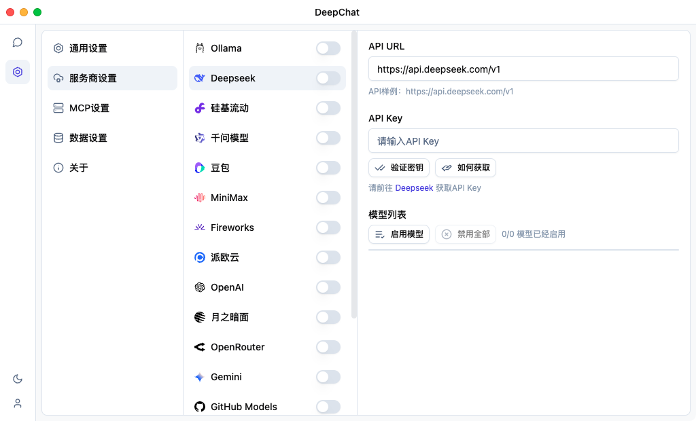
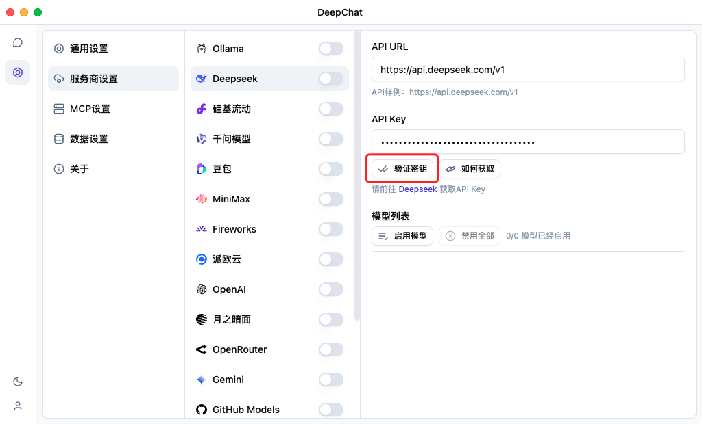
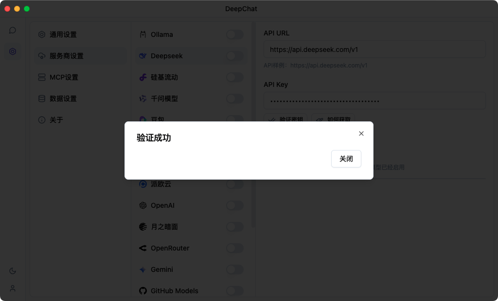
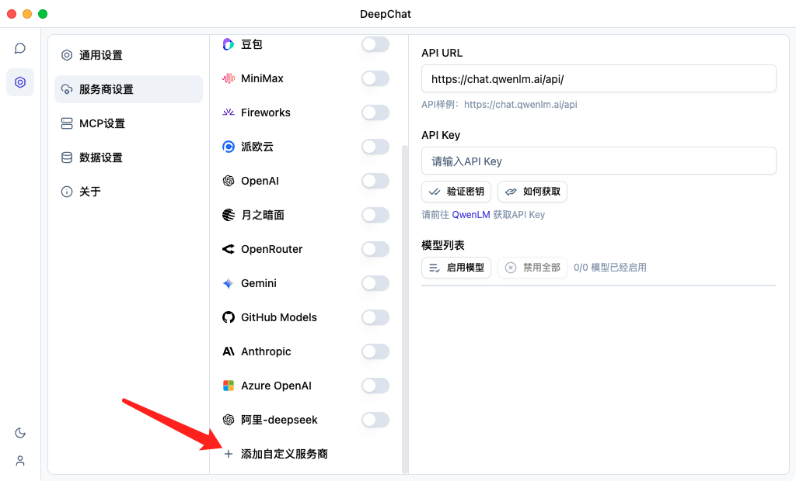
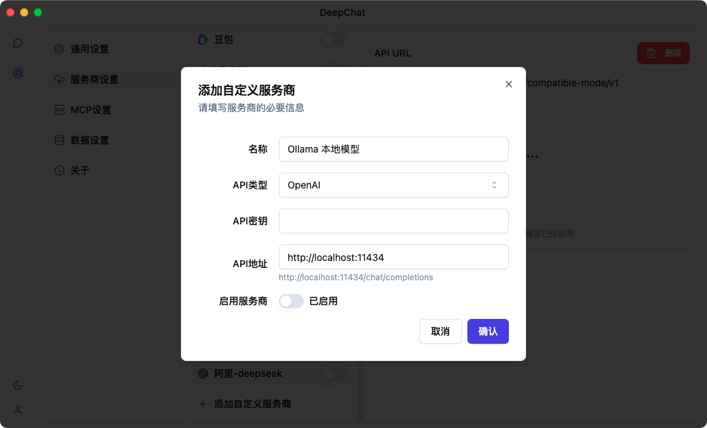

# 首次使用配置

成功安装 DeepChat 后，您只需要连接到大语言模型即可开始使用。本指南将帮助您快速配置模型并开始使用 DeepChat。

## 首次启动界面

首次打开 DeepChat 时，您会看到如下图所示的欢迎界面：

在此界面中，您可以直接点击"开始使用"进入主界面，然后配置您的大语言模型。

## 连接大语言模型

DeepChat 支持多种大语言模型，您需要选择并配置至少一种模型才能开始使用：

点击设置图标或在左侧菜单中选择相关选项，即可进入模型配置界面。

### 配置 DeepSeek 模型

DeepChat 支持使用 DeepSeek 的模型：

1. 从下拉菜单中选择"DeepSeek"
2. 访问 DeepSeek 官网获取 API 密钥
3. 将 API 密钥粘贴到相应字段
5. 点击"验证"测试连接
   
   
6. 显示成功就完成模式配置了

### 配置本地模型

使用本地部署的开源模型：

1. 从下拉菜单中选择"添加自定义服务商"
   
2. 填入配置参数
   
   - 选择API类型：
     - OpenAI【除了OpenAi自己的大模型，国内的大模型都是这种】
     - Gemini【Google的大模型】
     - Anthropic【例如Claude系统】
   - 输入服务地址（默认为 `http://localhost:端口号`）
   - 启用服务商
   - 完成

::: warning 注意
使用本地模型前，需要先安装并运行相应的模型服务器软件。
:::

## 故障排除

配置过程中可能遇到的常见问题：

| 问题 | 解决方法 |
|------|---------|
| API 密钥验证失败 | 检查 API 密钥是否正确；确认账户余额充足；检查网络连接 |
| 本地模型连接失败 | 确认本地服务器正在运行；检查 URL 和端口是否正确；检查防火墙设置 |

如果您遇到其他问题，请参考[故障排除](../troubleshooting/)章节。

完成模型配置后，您可以继续了解 DeepChat 的[基础功能演示](./basic-demo.md)。 