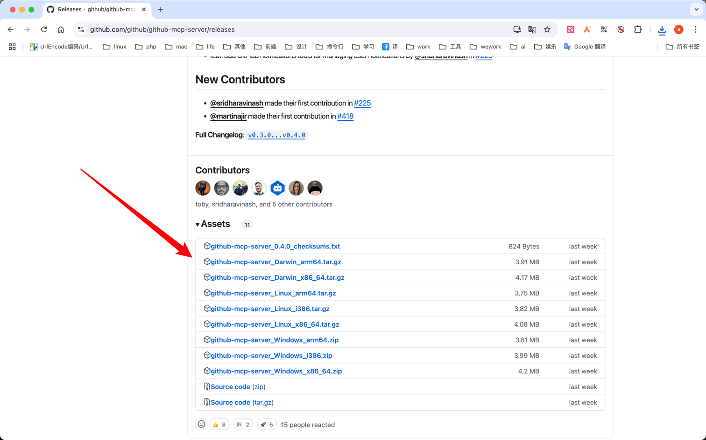
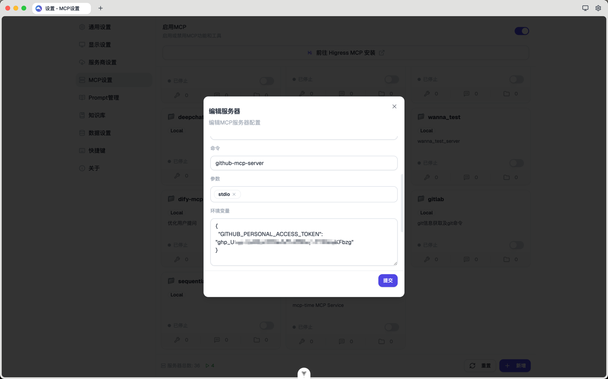
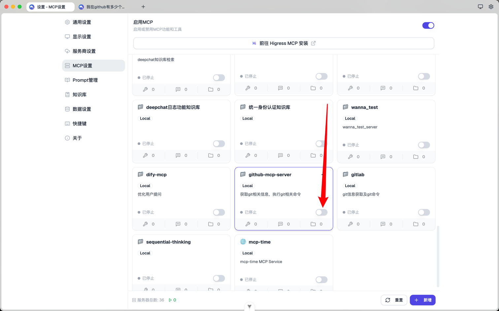
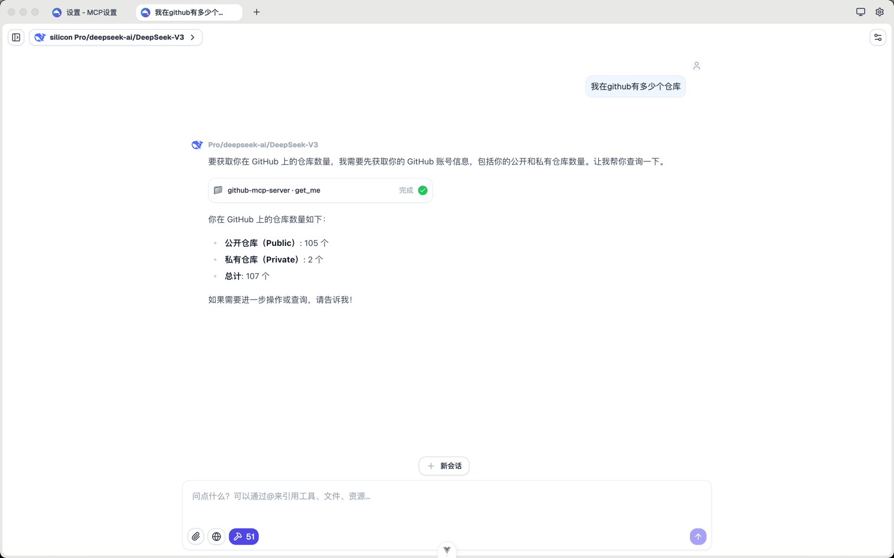

# 手动安装MCP

DeepChat 允许用户手动添加MCP服务

## 安装方式
通过安装[github-mcp-server](https://github.com/github/github-mcp-server)演示使用过程
1. [下载](https://github.com/github/github-mcp-server/releases)自己电脑系统对应可执行文件
2. 将可执行文件放到自己的path目录， 如mac 的`/usr/local/bin`目录
3. 按该mcp服务的文档添加配置到deepchat
4. 最后开启这个mcp即可 

下一步，您可以探索 DeepChat 的[模型集成](../model-integration/)功能，了解如何配置和使用不同的语言模型，进一步提升 AI 助手的能力。
