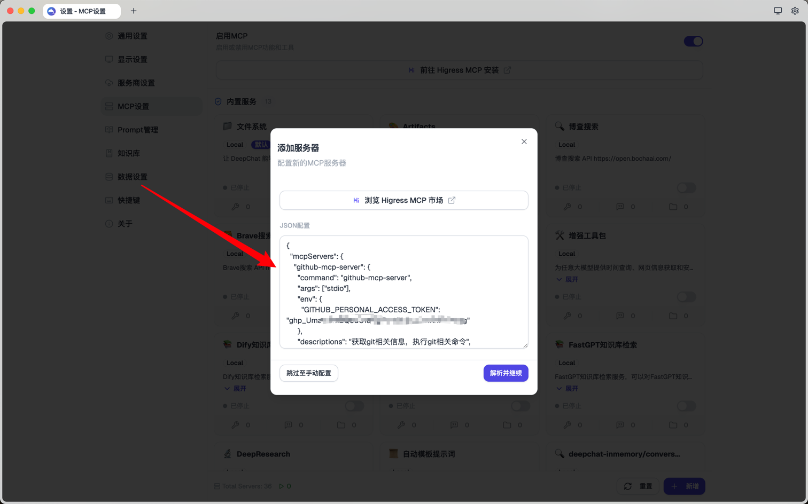
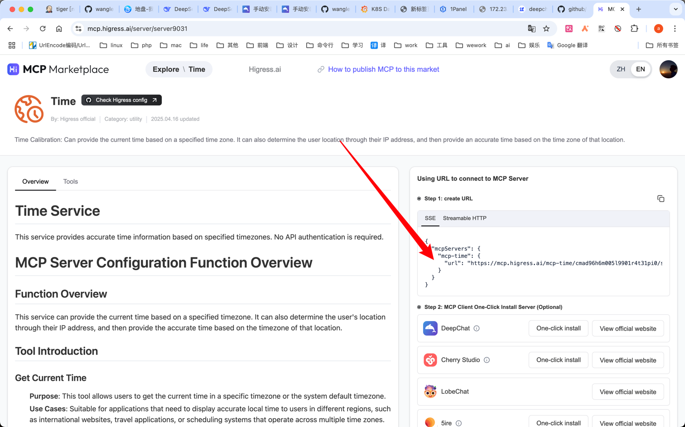
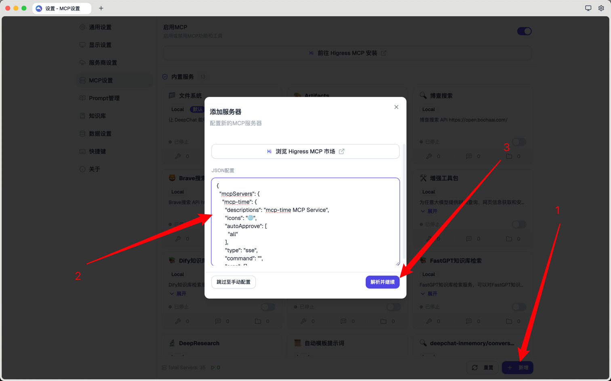
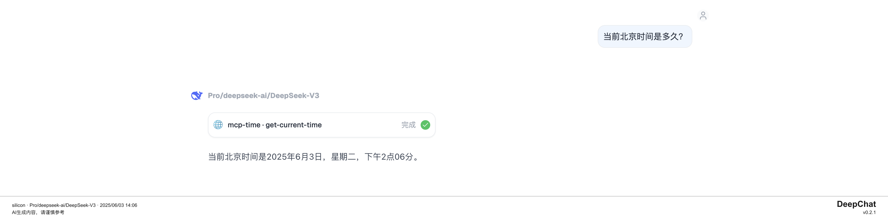

# 手动安装MCP

DeepChat 允许用户手动添加MCP服务

## stdio

通过安装[github-mcp-server](https://github.com/github/github-mcp-server)演示使用过程

### 配置格式

```json
{
  "mcpServers": {
    "github-mcp-server": {
      "command": "github-mcp-server",
      "args": ["stdio"],
      "env": {
        "GITHUB_PERSONAL_ACCESS_TOKEN": "ghp_****"
      },
      "descriptions": "获取git相关信息，执行git相关命令",
      "icons": "📁",
      "type" :"stdio",
      "autoApprove": ["all"]
    }
  }
}
```

### 具体步骤

1. [下载](https://github.com/github/github-mcp-server/releases)自己电脑系统对应可执行文件
2. 将可执行文件放到自己的path目录， 如mac 的`/usr/local/bin`目录
3. 按该mcp服务的文档添加配置到deepchat  
4. 最后开启这个mcp即可 


### 注意事项

- 获取 [GITHUB_PERSONAL_ACCESS_TOKEN](https://docs.github.com/zh/authentication/keeping-your-account-and-data-secure/managing-your-personal-access-tokens)

## sse

通过安装[higress Time Service](https://mcp.higress.ai/server/server9031)演示使用过程

### 配置格式

```json
{
  "mcpServers": {
    "mcp-time": {
      "descriptions": "mcp-time MCP Service",
      "icons": "🌐",
      "autoApprove": [
        "all"
      ],
      "type": "sse",
      "command": "",
      "args": [],
      "env": {},
      "baseUrl": "https://mcp.higress.ai/mcp-time/***/sse",
      "customHeaders": {},
      "customNpmRegistry": ""
    }
  }
}
```

### 具体步骤

1. 获取到sse的url 
2. 配置到deepchat 
3. 最后开启这个mcp即可（同[stdio](#stdio)）


### 注意事项

- 本地项目同理，只需要替换掉 `baseUrl` 即可


## Streamable http 
整体和[sse](#sse)类似，只是替换了 `baseUrl` 和 `type`

### 配置格式

```json
{
  "mcpServers": {
    "mcp-time": {
      "descriptions": "mcp-time MCP Service",
      "icons": "🌐",
      "autoApprove": [
        "all"
      ],
      "type": "http",
      "command": "",
      "args": [],
      "env": {},
      "baseUrl": "https://mcp.higress.ai/mcp-time/***",
      "customHeaders": {},
      "customNpmRegistry": ""
    }
  }
}
```

### 具体步骤

同 [sse](#sse)

下一步，您可以探索 DeepChat 的[模型集成](../model-integration/)功能，了解如何配置和使用不同的语言模型，进一步提升 AI 助手的能力。
