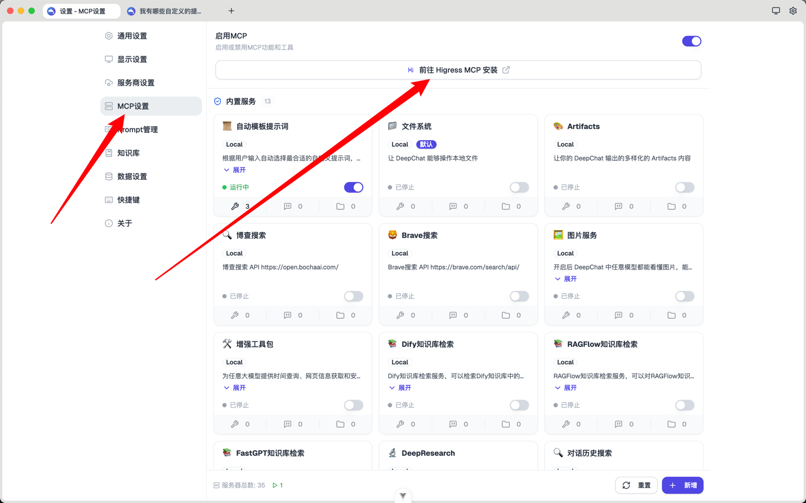
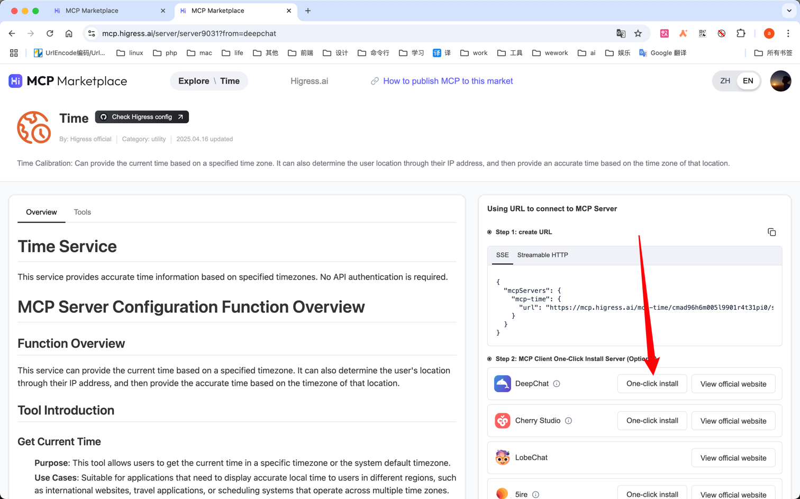
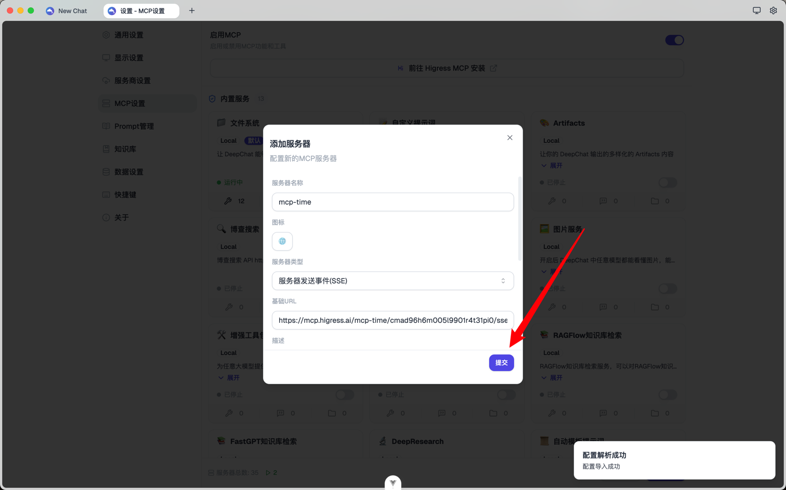
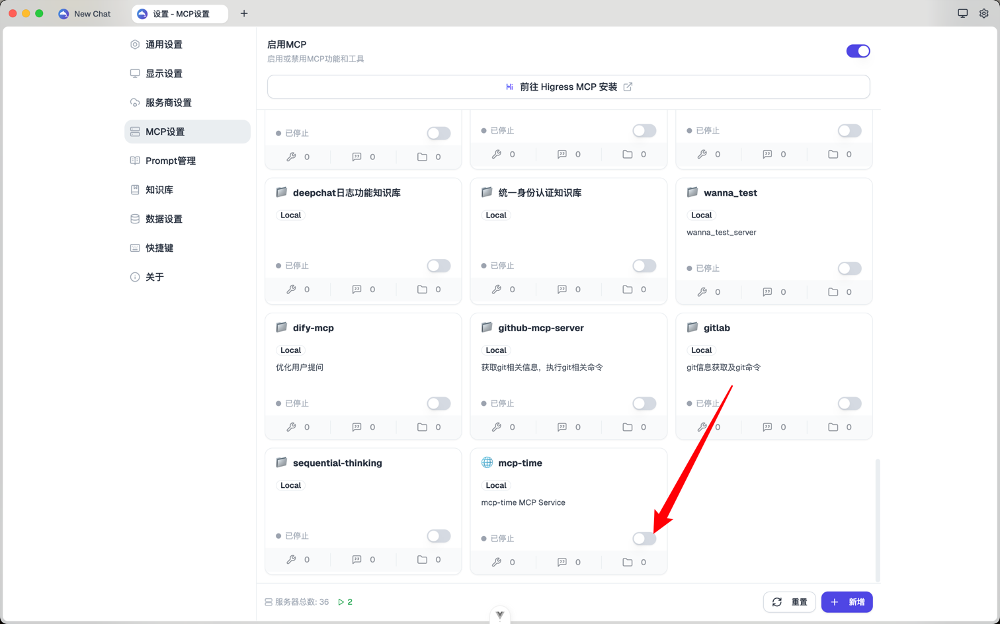
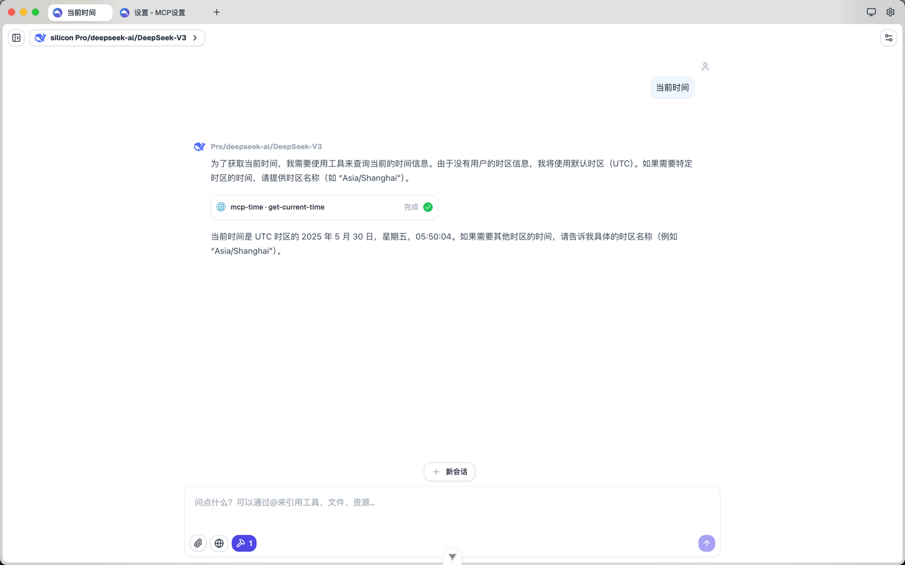

# higress安装MCP

DeepChat 提供通过higress一键安装MCP功能，为用户提供更丰富的使用场景。

## 安装方式
1. 通过链接跳转到 [higress 官网](https://mcp.higress.ai/?from=deepchat) 
2. 登录 higress 账号
3. 找到自己想要安装的项目，并点击确定
4. 在网页中找到 deepchat mcp 安装键！
5. 此时会自动跳转到 deepchat 页面，且自动解析数据并填充，检查无误后点击保存
6. 最后开启这个mcp即可

下一步，您可以了解  DeepChat 如何[手动安装mcp](./custom.md)，提供更为灵活的安装方式，更高阶的使用MCP。